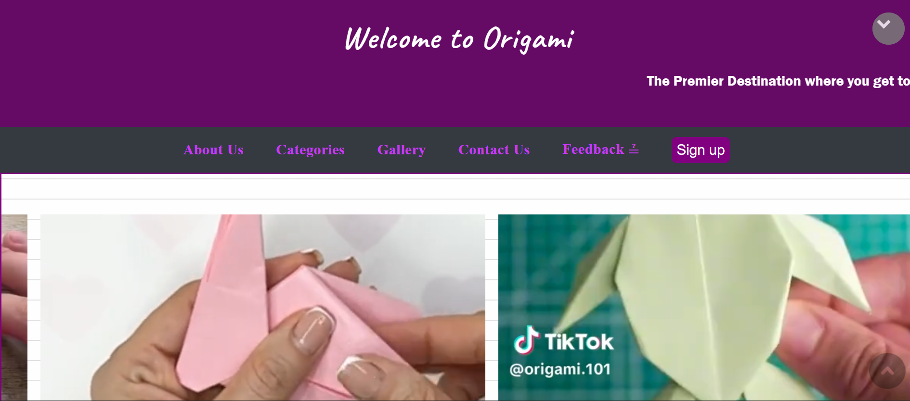
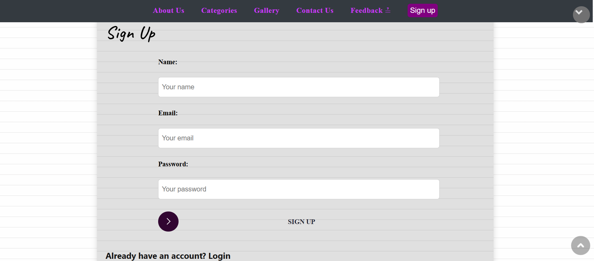
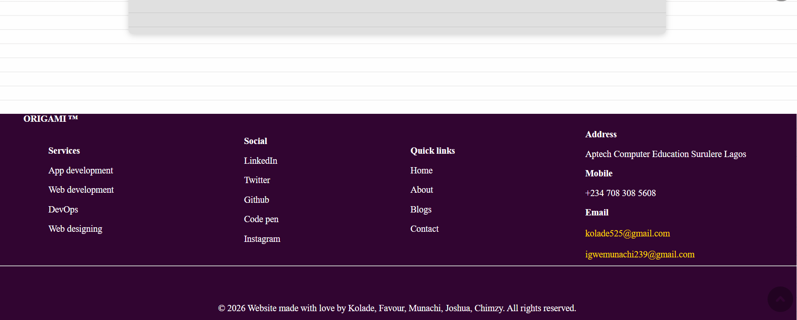

# Origami Website

A responsive single-page website built using HTML, CSS and JavaScript as part of my front-end development training.

## Live Demo

origami-website-five.vercel.app

## GitHub

https://github.com/Muna-Dany/Origami-Website

## Features

- Responsive layout
- Modern UI
- Smooth navigation
- Interactive sections

## Screenshots

### Video Display

### Sign Up Page

### Footer Page

## Technologies

- HTML5
- CSS3
- JavaScript